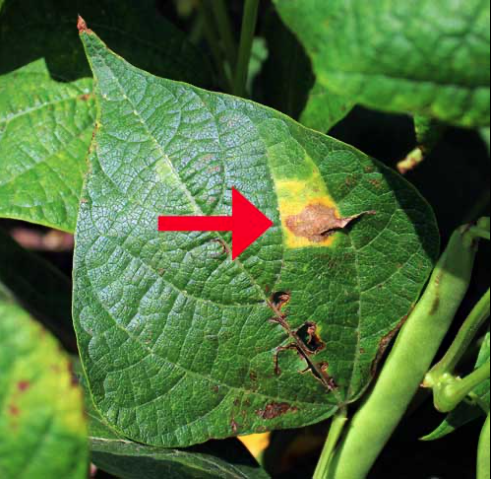

# Crop Leaf Disease Detection

# Problem statement

1. Crop diseases are heavily affected by disease which cause adverse effects on food security as well as economic losses

# About Dataset
We use a publicly available and quite famous, the [PlantVillage Dataset](https://www.kaggle.com/datasets/abdallahalidev/plantvillage-dataset) found kaggle 

The dataset consists of about 54,305 images of plant leaves collected under controlled environmental conditions. The plant images span the following 14 species:

Apple, Blueberry, Cherry, Corn, Grape, Orange, Peach, Bell Pepper, Potato, Raspberry, Soybean, Squash, Strawberry, and Tomato.
The dataset contains a total of 38 classes of plant disease and 1 class of background images 

# Useful links

1. The Google Colab Notebook can be viewed [here](Crop_leaf_disease_detection.ipynb).
2. Here is the presentation link  [here](https://drive.google.com/file/d/1ZIUygRHfAbFmDSSMAJH9aLJpXd47_ag6/view?usp=share_link).

